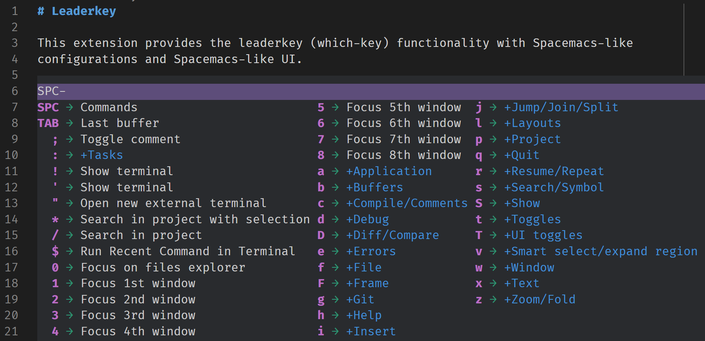
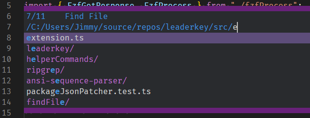
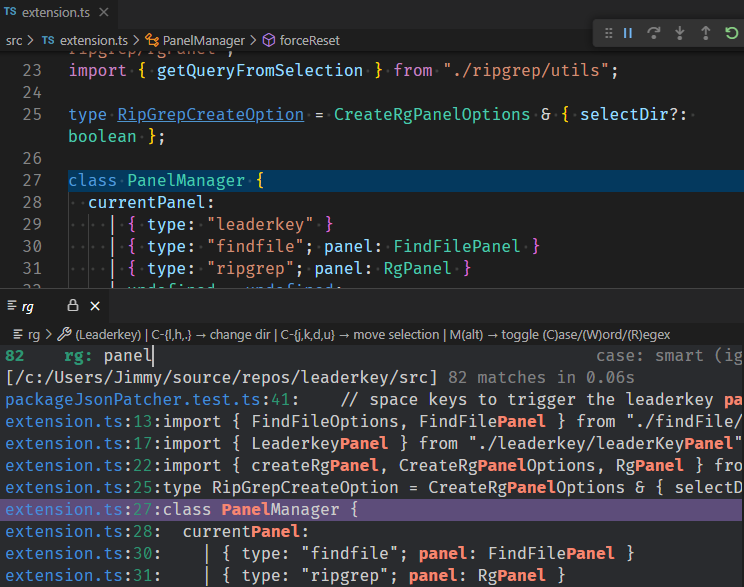

# Leaderkey

This extension provides the leaderkey (which-key) functionality with Spacemacs-like
configurations and UI.



... with some helpful keyboard-friendly file navigation utilities, including

- find-file (emacs-like, extended with fzf when query contains space)

  

- ripgrep (Spacemacs-like, with support of multi sub-queries split by space)

  

(Make sure you set "leaderkey.fzf.exe" and "leaderkey.ripgrep.exe")

It can be considered an alternative implementation to
[VSpaceCode](https://github.com/VSpaceCode/VSpaceCode) +
[vscode-which-key](https://github.com/VSpaceCode/vscode-which-key).
The default keybindings are mostly copied from VSpaceCode.

Leaderkey is designed with the following considerations in mind:

- Reliable key sequence handling (less likely to miss keys on lag spikes)
- Easy and intuitive way to customize by the user
- Better support in customizing keys from 3rd party libraries (infinite layers of configs)
- Very similar UI to Spacemacs

## Installation

Leaderkey works the best with the [Vim](https://aka.ms/vscodevim) extension. Here is all
the customization you need:

```json
"vim.normalModeKeyBindingsNonRecursive": [
    {
        "before": [ "<space>" ],
        "commands": [
            { "command": "_setContext", "args": [ "leaderkeyState", "SPC" ] },
            { "command": "leaderkey.render", "args": "SPC" }
        ]
    },
    {
        "before": [ "," ],
        "commands": [
            { "command": "_setContext", "args": [ "leaderkeyState", "," ] },
            { "command": "leaderkey.render", "args": "," }
        ]
    },
],
"vim.visualModeKeyBindingsNonRecursive": [
    {
        "before": [ "<space>" ],
        "commands": [
            { "command": "_setContext", "args": [ "leaderkeyState", "SPC" ] },
            { "command": "leaderkey.render", "args": "SPC" }
        ]
    },
    {
        "before": [ "," ],
        "commands": [
            { "command": "_setContext", "args": [ "leaderkeyState", "," ] },
            { "command": "leaderkey.render", "args": "," }
        ]
    },
],
```

If you are not using vscodevim, the example keybinding

```json
{ "key": "ctrl+space", "command": "leaderkey.render", "args": "SPC" }
```

is all you need to bind `ctrl+space` to trigger the `SPC` menu.
(The `_setContext` command is used to improve reliability but is totally optional)

## Documentation

### To use

If vim is installed and configured as above, `SPC` in normal/visual mode should trigger
the a menu that looks like this in your active editor


You can keep pressing keys to go to further sub-menus or run commands.

Press `backspace` to erase the last key you typed! (not a standard Spacemacs behavior)

The `,` (comma) menu is also useful to perform some language-level operations like go-to
definitions.

### To customize

Leaderkey is extremely straightfoward to customize in your user `settings.json`. Examples
are shown below

```json
"leaderkey.overrides.user": {
    "SPC b TAB": {
        "name": "focus the other side (diff view)",
        "commands": [
            "workbench.action.compareEditor.focusOtherSide",
            {
                "command": "cursorMove",
                "args": {
                    "to": "viewPortCenter"
                }
            }
        ]
    },
    ", h": "Hover...",
    ", h t": {
        "name": "show type",
        "command": "editor.action.showDefinitionPreviewHover"
    },
}
```

I've added two commands (`SPC b TAB` and `, h t`) and one menu (`, h`) to the default
bindings in the example above.

Commands can be defined with "command" and "args" keys or a "commands" structure
which is passed to the builtin "runCommands" command.

Menus are totally optional and is only used to show the name on it's parent menu. (e.g. in
the above screenshot, the `b` sub-menu is named `Buffers` by default)

All the keys are recommended to follow the emacs/spacemacs convention. E.g. use `D` for
`shift+d` and `!` for `shift+1`. For now we only support `ctrl` and `shift` modifier keys
(but not both). It should be straightfoward to extend if you set custom ones following the
default keybindings in `package.json`.

### Migrating from VSpaceCode

If you have a complex set of vspacecode keybindings like I do, Leaderkey provides a
convenient way to help migration. The helper command

```
Try migrating the config from VSpaceCode to leaderkey (leaderkey.migrateFromVSpaceCode)
```

will read your `vspacecode.bindingOverrides` setting and try to generate a set of
leaderkey settings for `leaderkey.overrides.user`.

### Conditional bindings

Due to a [limitation](https://github.com/microsoft/vscode/issues/10471) of the VSCode API,
extensions simply cannot read current context and check `when` condition clauses.

The only way to encode any `when` condition is via `keybindings.json`. Therefore, the
leaderkey way of defining conditional commands is as follows (this is the only built-in
conditional command of leaderkey):

(Note that our approach is similar to but slightly different from which-key)

- Set the command key chord to contain a _condition description_ like
  `SPC f t:explorerVisible` where the `t` key is conditionally executed when the
  "explorerVisible" condition is set.
- Override the binding of `t` key with a `when` condition

```json
{
    "key": "t",
    "when": "leaderkeyState == 'SPC' && sideBarVisible && explorerViewletVisible",
    "command": "leaderkey.onkey",
    "args": {
        "key": "t",
        "when": "explorerVisible"
    }
},
```

so that the condition is checked by VSCode and the _condition description_ of leaderkey is
passed via the `when` arg.

It's worth mentioning that the condition flags of leaderkey is set globally for the
current key chord, and the library in fact set the condition on `f` instead (which is the
key before `t`). The benefit is that the `SPC f` menu would be rendered properly according
to the condition, i.e. the command name of `SPC f t:explorerVisible` will be shown instead
of `SPC f t`.

```json
{
    "key": "f",
    "when": "leaderkeyState == 'SPC' && sideBarVisible && explorerViewletVisible",
    "command": "leaderkey.onkey",
    "args": {
        "key": "f",
        "when": "explorerVisible"
    }
},
```

Leaderkey also display the condition next to the sequence of keys you typed to make it
easier to debug.

### For 3rd party libraries

If you write an extension that depends on leaderkey and want to provide some default
bindings, leaderkey is happy to cooperate!

Basically you just need to declare a configuration contribution point with default value.

```json
{
  "contributes": {
    "configuration": {
      "title": "<some title>",
      "properties": {
        "leaderkey.overrides._your_extension_name": {
          "type": "any",
          "description": "leaderkey additional bindings",
          "default": {
            "SPC b TAB": {
              "name": "focus the other side (diff view)",
              "commands": [
                "workbench.action.compareEditor.focusOtherSide",
                {
                  "command": "cursorMove",
                  "args": {
                    "to": "viewPortCenter"
                  }
                }
              ]
            }
          }
        }
      }
    }
  }
}
```

Additionally, you should depend on leaderkey

```json
"extensionPack": [
    "JimmyZJX.leaderkey"
],
"extensionDependencies": [
    "JimmyZJX.leaderkey"
],
```

and call the following command while initializing your extension. The reason is that the
order of extension loading is not deterministic and leaderkey might be initialized too
early and miss you additional bindings during the initial scan.

```ts
await vscode.commands.executeCommand("leaderkey.refreshConfigs");
```
